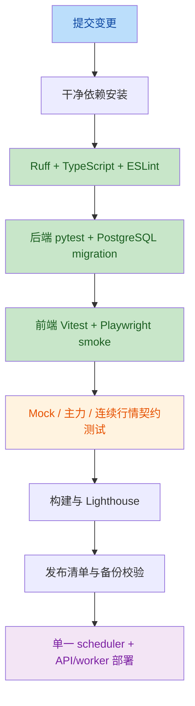

# 项目全面审查与后续迭代计划

> 审查日期：2026-07-18  
> 审查分支：`master`  
> 审查基线：`0530a94b fix: K线时间格式YYYY-MM-DD + 主力合约数据同步修复`  
> 范围：代码、测试、依赖、数据库迁移、CI/CD、容器部署、运行文档和路线图。

## 1. 结论摘要

项目已经形成较完整的期货行情、研究工作区、回测、因子和 Agent 能力，代码分层、认证、缓存、数据质量和前端测试基础均已具备。当前主要问题不是功能数量不足，而是**行情数据读模型、测试基线、依赖锁和文档状态没有收敛到同一个事实源**。

当前不建议直接进入新的策略或 Agent 功能开发。推荐先完成一轮“可运行性收口”，把核心行情入口和质量门禁恢复为全绿，再推进数据管道与生产部署治理。

## 2. 可复现基线

### 2.1 仓库规模

| 项目 | 当前事实 |
| --- | --- |
| 工作区 | 当前代码变更已提交并推送，文档更新进行中 |
| 后端源码 | 350 个 Python 文件 |
| 后端测试 | 85 个 pytest 文件 |
| 前端测试 | 33 个 Vitest 文件，6 个 Playwright spec |
| Alembic | 58 个迁移脚本 |
| 前端构建 | 通过，最大 First Load JS 为 `/products/[id]` 的 147 kB |
| 当前产品形态 | 行情/研究工作台，不是真实交易终端 |

### 2.2 质量命令结果

| 检查 | 结果 | 说明 |
| --- | --- | --- |
| `python -m pytest tests -q --tb=short` | **961 passed, 0 failed, 6 skipped** | Phase 0 修复后全量通过 |
| `python -m ruff check .` | 通过 | `python/` 范围门禁全绿 |
| `npx tsc --noEmit` | 通过 | 类型检查通过 |
| `npm run lint` | 通过 | ESLint 无警告/错误 |
| `npm run test` | **192 passed, 0 failed** | K 线调用契约测试已同步 |
| `npm run build` | 通过 | 18 个路由生成成功 |
| 单独运行 `test_phase1_3_integration.py` | **26 passed, 0 failed** | schema 测试显式依赖建表 fixture |

> 本次后端命令使用项目 `python/.venv` 执行；依赖 lock 已包含 `scikit-learn`、`feedparser` 及其运行依赖。后续 CI 继续使用 lock 文件创建干净环境。

## 3. 关键发现

| 编号 | 优先级 | 发现 | 证据与影响 | 后续动作 |
| --- | --- | --- | --- | --- |
| F-01 | **P0** | `/api/varieties` 主数据链路断裂 | [routers/varieties.py:34-65](../python/routers/varieties.py#L34-L65) 只查 `fut_main_daily_data`；[init_mock_data.py:95-105](../python/data_collector/init_mock_data.py#L95-L105) 只写 `kline_data`，不写 `fut_main_daily_data`。开发 Mock 启动后列表为空，7 个后端测试失败。 | 统一行情列表读模型；补齐 Mock/fixture/真实采集三种数据路径的契约测试。 |
| F-02 | **P0** | 发布基线不全绿 | 后端 7 失败、前端 1 失败，现有文档仍写 `669/812 passed` 等旧结果。当前状态不能作为可发布证据。 | 先修 F-01、F-03、F-04、F-05，再重新生成唯一基线。 |
| F-03 | **P1** | 后端 Ruff 门禁失败 | `ruff check .` 报 10 项；CI 在 [backend-ci.yml:63-74](../.github/workflows/backend-ci.yml#L63-L74) 直接执行 `ruff check .`，因此当前 CI 不能全绿。 | 先用 `ruff --fix` 处理可机械修复项，再人工处理动态导入和排序规则。 |
| F-04 | **P1** | 前端 K 线测试与实现契约漂移 | 实现通过 [useProductKline.ts:93-95](../frontend/hooks/useProductKline.ts#L93-L95) 走 `loadKlineBySource`；测试 [useProductKline.test.tsx:38-40](../frontend/tests/hooks/useProductKline.test.tsx#L38-L40) 仍断言旧日期/limit 参数。 | 以 `loadKlineBySource` 的公开契约重写测试，补充 main/continuous/single 三种来源断言。 |
| F-05 | **P1** | Python 依赖锁不完整 | [requirements.txt:37-42](../python/requirements.txt#L37-L42) 声明 `scikit-learn`，但 `requirements.lock` 没有该包；策略进化模块直接导入 `sklearn`。当前机器已有环境包，干净 CI 可能在测试收集阶段失败。 | 重新生成 lock，并增加“requirements 与 lock 无漂移”检查。 |
| F-06 | **P1** | Agent 步骤持久化重新变成逐步提交 | [executor.py:72-86](../python/services/agent/executor.py#L72-L86) 每个步骤都 `commit()`，调用方又逐步调用；这与路线图中“批量提交、避免 SQLite locked”的状态描述相反。高步骤数或并发 SSE 下会增加锁竞争和事务开销。 | 改为任务级批量 `add_all + flush/commit`，失败时统一回滚并保留错误步骤。 |
| F-07 | **P1** | 生产调度拓扑不一致 | [docker-compose.yml:46-55](../docker-compose.yml#L46-L55) 的 backend 设置 `ENABLE_SCHEDULER=1`，但 compose 没有 worker；运行文档又要求生产使用独立 `python/worker.py`。后续若额外启动 worker，会产生重复采集；若不启动，API 进程承担了不应承担的任务。 | 明确单一 scheduler owner：API 默认 `0`，新增独立 worker service 或在部署文档中明确单进程方案。 |
| F-08 | **P1** | 测试隔离依赖执行顺序 | `test_all_tables_exist` 直接 `inspect(engine)`，单独运行时在 fixture/lifespan 建表前失败。该测试无法证明自身环境可运行，容易造成“全量通过、单文件失败”。 | 在 session fixture 中显式建表/迁移，测试只读取自己的 fixture；禁止依赖其他测试副作用。 |
| F-09 | **P2** | CI 门禁没有覆盖真实浏览器流程 | [frontend-ci.yml:46-54](../.github/workflows/frontend-ci.yml#L46-L54) 只跑 Vitest、Build 和 Lighthouse，没有 Playwright；后端 coverage 阈值为 30%。关键登录、行情、详情和工作区流程仍缺自动化发布门禁。 | 增加最小 Playwright smoke；将 coverage 先提升到 40%，再按模块覆盖率逐步提高。 |
| F-10 | **P2** | 文档没有唯一现状基线 | `frontend/README.md` 仍写 Next.js 14.1.0；`README.md`、`AGENTS.md`、`.agents/roadmap.md`、`docs/` 记录的测试数、迁移数、阶段状态和旧 ProductDB 计划互相不一致。 | 以本文件作为当前基线，随后同步 README/AGENTS/roadmap；历史文档只保留在 archive。 |
| F-11 | **P2** | 行情列表存在两套实现 | `services/domain/market_data_service.py:131-219` 已有 `VarietyDB + RealtimeQuoteDB` 聚合实现，但实际路由自己查询 `FutMainDailyDataDB`，形成未使用服务与路由逻辑分叉。 | 选定 canonical read model，将 router 收敛为薄层，删除或重构重复查询。 |
| F-12 | **P2** | Agent SQL 工具仍依赖正则解析 | `.agents/roadmap.md:258-262` 已承认 `database_tools.py` 仅用正则白名单和字符串注入。多表 JOIN、子查询、大小写/别名和 `user_id` 自动注入都不是 AST 级安全边界。 | 保持当前风险接受，但远期改为 SQL AST 只读校验和显式用户数据访问 API。 |

### 交叉验证结论

两名独立审查代理分别复核了全部 12 项候选问题：12/12 确认问题存在；对 F-01、F-02、F-03、F-04、F-05、F-06、F-07、F-08、F-09、F-10 的存在性达成 2/2 共识。F-11、F-12 的严重性在“架构债务”和“已接受风险”之间存在差异，本计划按当前产品形态保守归为 P2，不把它们当作本轮发布阻断项。

## 4. 当前架构判断

### 已具备的基础

- FastAPI 路由按领域拆分，数据库迁移、错误码、认证、CSRF、限流和缓存均已有实现。
- Agent 已覆盖数据、技术分析、风控、策略编排、回测、因子和交易计划，且有 SSE 事件模型。
- 前端已经有统一 API client、SSE/轮询降级、K 线数据工具和较完整的 Vitest 基础。
- PostgreSQL、Redis、备份脚本、可观测性 runbook 和生产配置检查已经存在。

### 当前真正的结构性问题

```mermaid
flowchart LR
    A[Mock / AkShare / Tushare] --> B{数据落点}
    B --> C[KlineDataDB]
    B --> D[FutDailyDataDB]
    B --> E[FutMainDailyDataDB]
    C --> F[连续 K 线与 fallback]
    D --> G[具体合约日线]
    E --> H[/api/varieties 与主力日线]
    I[开发初始化与测试 fixture] --> C
    I --> J[RealtimeQuoteDB]
    J --> K[实时行情 API]
    H -. 当前没有数据 .-> L[行情列表为空]
    style A fill:#bbdefb,color:#0d47a1
    style B fill:#fff3e0,color:#e65100
    style C fill:#f3e5f5,color:#7b1fa2
    style D fill:#f3e5f5,color:#7b1fa2
    style E fill:#f3e5f5,color:#7b1fa2
    style L fill:#ffcdd2,color:#b71c1c
```

核心矛盾是：数据表已经按“原始 K 线、具体合约日线、主力日线、实时快照”拆开，但没有一个明确的**行情列表读模型**和统一的测试数据工厂。新增数据路径时，路由、Mock、fixture、Agent 和文档很容易只更新其中一部分。

## 5. 后续迭代路线

### Phase 0：可运行性收口（P0，0.5-1 天）

目标：恢复开发环境和 CI 的全绿基线。

1. 决定 `/api/varieties` 的契约：
   - 推荐：主力日线存在时使用 `FutMainDailyDataDB`；
   - 没有主力日线时回退到 `RealtimeQuoteDB + VarietyDB`，并在响应中保留数据新鲜度/来源；
   - Mock 初始化同时生成最小 `FutMainDailyDataDB` 样本，避免测试只覆盖 fallback。
2. 更新 `seed_varieties` 和相关测试工厂，明确 `VarietyDB`、实时快照、主力日线、合约映射的最小组合。
3. 修复 `useProductKline` 测试契约，使 main/continuous/single 三条路径均有断言。
4. 补齐 `scikit-learn` lock，执行干净环境安装验证。
5. 清零 Ruff 10 项错误。

验收：

- 后端 `pytest tests -q --tb=short`：`0 failed`；
- 前端 `npm run test`：`0 failed`；
- `ruff check .`、`tsc --noEmit`、`npm run lint`、`npm run build` 全部通过；
- `/api/varieties` 在 Mock SQLite、PostgreSQL 样本库、真实主力数据三种场景均返回非空或可解释的空状态。

### Phase 1：行情读模型收敛（P1，2-3 天）

目标：消除 router/service/collector 的数据语义分叉。

1. 将列表聚合逻辑收敛到 `MarketDataService`，router 只做参数校验、鉴权和响应头。
2. 明确三个数据集的职责：
   - `RealtimeQuoteDB`：短期实时快照；
   - `FutDailyDataDB`：具体合约历史日线；
   - `FutMainDailyDataDB`：主力/连续历史日线。
3. 为 `fut_main_daily_data` 建立可重跑的同步任务：
   - 由主力映射决定 `ts_code`；
   - upsert 以 `(variety_id, ts_code, period, trade_date)` 为幂等键；
   - 记录 `data_source`、最后成功时间和失败原因。
4. 增加数据质量门禁：主力数据缺失、交易日期过期、合约映射失效时，健康检查和列表响应都给出可观测状态。
5. 增加 SQLite/PG 双方言回归，尤其验证窗口函数、布尔条件、日期和 Numeric 精度。

验收：

- 列表、详情、主力 K 线、连续 K 线使用同一套来源优先级；
- 每种来源均有最小样本、空数据和过期数据测试；
- 采集重跑不产生重复主力日线。

### Phase 2：执行可靠性与生产拓扑（P1，2-3 天）

目标：降低 Agent/SSE 和采集任务在生产中的锁竞争与重复执行风险。

1. `AgentExecutor` 改为任务级事务：
   - 步骤先 `add_all`；
   - 统一 `flush`/`commit`；
   - 异常统一 rollback，再记录失败状态；
   - 为任务步骤增加唯一约束或幂等写入策略。
2. Compose 采用单一 scheduler owner：
   - backend `ENABLE_SCHEDULER=0`；
   - 新增 `worker` service 执行 `python worker.py`；
   - API 和 worker 分别有健康检查及退出日志。
3. CI 增加：
   - lock 漂移检查；
   - Playwright 未登录 smoke 和登录后的最小行情流程；
   - PostgreSQL migration + API smoke；
   - coverage 从 30% 提升到 40%，并公布排除项。

验收：

- 10 个以上 Agent 步骤并发执行无 `database is locked`；
- compose 只产生一个 scheduler；
- CI 能在干净环境完成安装、迁移、后端测试、前端测试和 smoke。

### Phase 3：文档与发布治理（P1/P2，1-2 天）

目标：让文档成为可维护的工程资产，而不是历史记录集合。

1. 本文件作为当前迭代基线；同步更新 `README.md`、`AGENTS.md`、`.agents/project.md`、`.agents/roadmap.md` 和 `frontend/README.md`。
2. 所有测试数量、迁移数量和完成状态改为“生成时间 + 命令 + 结果”，不再手工维护模糊数字。
3. 将 ProductDB 退场、旧端口和已完成阶段的旧计划移动到 `docs/archive/`，保留链接但不再作为当前指导。
4. 建立发布清单：
   - 代码质量；
   - 数据库迁移；
   - Mock/真实数据；
   - 认证和权限；
   - 前端 smoke；
   - 备份恢复；
   - 回滚方案。

### Phase 4：远期风险和性能（P2，按数据规模排期）

- 将 Agent SQL 查询从正则校验升级到 AST 只读校验，用户私有数据改用显式 repository/API。
- 按实际 K 线规模决定 `kline_data` 分区、归档和冷热数据策略。
- 拆分超大模块：`models.py`、`schemas.py`、`strategies/page.tsx`、Agent 策略进化模块。
- 将 mypy 从“排除大量目录”推进为按领域逐步纳入，优先覆盖 services 和 data pipeline。
- 引入数据血缘、采集死信和可恢复的失败重试记录。

## 6. 目标状态



最终发布门槛建议固定为：

- 后端测试 `0 failed`，跳过项有明确原因；
- 前端类型、Lint、Vitest、Playwright smoke、Build 全部通过；
- Ruff 和依赖锁检查全绿；
- `/api/varieties`、主力 K 线、连续 K 线在 Mock/PG/真实样本上有可复现结果；
- API 与 worker 不重复启动 scheduler；
- 文档中的状态、命令和结果与最近一次 CI 运行一致。

## 7. 建议的下一轮提交拆分

1. `fix(data): restore varieties read model and seed main daily fixtures`
2. `test(frontend): align product kline contract tests`
3. `chore(python): regenerate lock and clear ruff gate`
4. `fix(agent): batch persist task steps in one transaction`
5. `chore(ops): separate api and scheduler worker`
6. `test(ci): add clean-install and browser smoke gates`
7. `docs: refresh current project baseline and archive stale plans`

每个提交都应独立运行对应的最小验证，并在最后一次提交更新本文件的“可复现基线”。

## 8. 执行记录

### Phase 0：可运行性收口（2026-07-18）— 已完成

已完成事项：

- Mock 初始化补齐 `FutMainDailyDataDB` 主力日线，恢复 `/api/varieties` 列表数据；
- 同步 `useProductKline` 测试与 `loadKlineBySource` 新契约；
- `requirements.txt` 增加直接依赖 `feedparser`，lock 补齐 `scikit-learn`、`joblib`、`threadpoolctl` 和 RSS 依赖；
- 清理 Python Ruff 门禁错误；
- schema 集成测试显式依赖 `db_session`，支持单文件独立运行。

验收结果：

- 后端：`961 passed, 6 skipped, 0 failed`；
- 前端：`192 passed, 0 failed`；
- TypeScript、ESLint、Next production build、Python Ruff 全部通过。

对应提交：

`5e9f81be`、`29517ba4`、`401940c5`、`739908d3`、`ddd622fc`、`15cf91e6`。

### Phase 1：行情读模型收敛（2026-07-18）— 已完成

已完成事项：

- `/api/varieties` 路由收敛为参数、鉴权、响应头转换，查询逻辑统一进入 `MarketDataService`；
- 主力日线优先、实时快照 fallback、无数据 `unavailable` 状态统一为一套读模型；
- 响应增加 `data_source` 与 `data_freshness`，前端 `Product` 类型同步；
- 新增 `upsert_fut_main_daily_bulk`，复用日线数据幂等键并支持 PostgreSQL/SQLite 方言；
- 新增 `run_fut_main_daily`、scheduler job `fut_main_daily` 和 PostgreSQL 主力日线 upsert 回归测试。

验收结果：

- 行情服务、品种 API、scheduler health、pipeline rollover、PG upsert 测试专项：`52 passed, 6 skipped`；
- Python `ruff check .`、前端 TypeScript、ESLint 和相关 Vitest 全部通过。

对应提交：`9b44678c feat(data): unify varieties market read model`。

下一项：Phase 2「执行可靠性与生产拓扑」。
